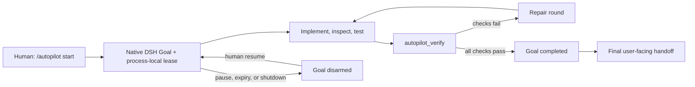

# DSH Autopilot

[简体中文](README.zh-CN.md)

Long-running, verifier-gated autonomous development for [DeepSeek Harness](https://github.com/deepseek-ai/deepseek-harness).

**Give DSH a goal, a budget, and a finish line.** Start Autopilot once and let the model implement, inspect, test, repair, and verify across as many bounded Goal rounds as the task needs.

- **Run for days, not hours.** Active-time leases default to seven days and can be deployed with ceilings up to 30 days.
- **Prove completion.** The model cannot mark its own work complete while Autopilot is active; deployment-owned commands decide.
- **Repair instead of stopping.** Failed verification returns concrete results to the next Goal round.
- **Create missing runtime tools.** Optional Host-only Cordis extension lets the model define a temporary capability inside the current lease.
- **Stay native to DSH.** No fork, no `agent-loop` patch, no hidden Goal database, and no silent permission elevation.

Inspired by [oh-my-codex](https://github.com/Yeachan-Heo/oh-my-codex) and [oh-my-openagent](https://github.com/code-yeongyu/oh-my-openagent) (formerly `oh-my-opencode`), DSH Autopilot rebuilds the long-running agent experience around DSH's native Goal, Cordis, tool-policy, and session primitives.

> [!IMPORTANT]
> DSH Autopilot is an independent, third-party project. It is not a DeepSeek product, a DSH fork, or a way to bypass DSH permissions. Every contribution is installed as an additive Cordis plugin row and can be removed again.

## From one command to verified completion

DSH already provides the important primitives: durable Goals, automatic Goal rounds, workflows and subagents, tool guards, shell execution, session logs, and runtime Cordis Packages. What it does not provide as one product surface is a human-controlled long-running development loop with a fixed completion gate.

DSH Autopilot adds that control layer:

1. a human authorizes a concrete objective, round limit, and active-time budget;
2. DSH keeps the native Goal moving across model turns;
3. the model implements, inspects, tests, and repairs the workspace;
4. only deployment-configured verifier commands may complete the Goal;
5. optional dynamic Cordis extension remains inside the selected DSH preset and permission policy;
6. pause, expiry, shutdown, and restart fail closed.

The default lease supports work measured in days rather than hours: 256 Goal rounds and seven days of active time. Deployment ceilings default to 1,024 rounds and 30 active days. Paused time is not charged.

## What DSH Autopilot adds

| Capability | What it adds to DSH |
|---|---|
| Human authorization | `/autopilot start`, `status`, `pause`, `resume`, and `stop` commands on a top-level Agent. The model cannot grant or extend its own lease. |
| Long-running Goal control | A bounded, process-local autonomy lease around DSH's native durable Goal and Goal Round Driver. |
| Verifier-owned completion | `autopilot_verify` runs deployment-fixed commands. Direct model completion is guarded while a lease is active. |
| Verified final handoff | A passing verifier schedules one final model response that summarizes the outcome, checks, and artifacts for the user. |
| Repair rounds | A failed verifier rearms the same Goal with inspectable results so the next round can repair the failure. |
| Resource limits | Active duration, Goal rounds, verification attempts, and successful dynamic Package definitions are bounded independently. |
| Dynamic Cordis policy | `off`, `host-only`, and `client-approved` modes guard DSH's existing `cordis_define` and `cordis_run` tools. |
| Model context | `get_autopilot` and a system-prompt policy section expose the current Goal, lease phase, and remaining budgets. |
| Bundled workflow skill | An `autonomous-development` skill teaches compatible DSH presets how to operate the loop and hand completion to the verifier. |
| Installation diagnostics | `dsh-autopilot doctor` checks Node compatibility and verifies that every bundle row appears exactly once. |

The package installs four additive Cordis rows:

| Row | Responsibility |
|---|---|
| `dsh-autopilot-service` | Validate deployment limits and own process-local autonomy leases. |
| `dsh-autopilot-commands` | Register the human `/autopilot` command. |
| `dsh-autopilot-tools` | Register model tools, policy context, completion guards, verifier execution, and dynamic-Package accounting. |
| `dsh-autopilot-skills` | Register the packaged workflow skill through DSH's public Skill service. |

No DSH source file is patched or replaced.

## Lifecycle at a glance



The native Goal is session-durable. The authorization lease, expiry timer, verification counter, and dynamic-Package receipts are deliberately process-local. After DSH restarts, the Goal remains disarmed until a human explicitly runs `/autopilot resume`.

## Status and compatibility

This repository is pre-release software. The current alpha is developed and tested against:

- DSH `0.1.0-rc.5`;
- `@deepseek-ai/cordis` `4.0.1`;
- Node.js `^22.19.0` or `>=24.0.0`.

DSH is still in release-candidate development, so this project intentionally uses narrow peer versions and validates upgrades explicitly.

## Installation

The alpha channel is published to npm under the canonical package name `dsh-autopilot`. Install the current alpha into a DSH profile and verify the resolved bundle:

```sh
dsh plugin --profile web add dsh-autopilot@next
dsh --profile web --dump-config
dsh plugin --profile web exec dsh-autopilot doctor --profile web
```

To pin this release exactly:

```sh
dsh plugin --profile web add dsh-autopilot@0.1.0-alpha.2
```

### Install a GitHub Release artifact

Download the `.tgz` attached to the release, then install that exact artifact into a DSH profile:

```sh
mkdir -p .artifacts
gh release download v0.1.0-alpha.2 \
  --repo LiuMengxuan04/dsh-autopilot \
  --pattern 'dsh-autopilot-*.tgz' \
  --dir .artifacts

dsh plugin --profile web add \
  ./.artifacts/dsh-autopilot-0.1.0-alpha.2.tgz
dsh --profile web --dump-config
dsh plugin --profile web exec dsh-autopilot doctor --profile web
```

### Build a local tarball

Development currently uses an exact sibling DSH checkout at `../harness`:

```sh
pnpm install --frozen-lockfile
pnpm pack --pack-destination .artifacts

dsh plugin --profile web add \
  ./.artifacts/dsh-autopilot-0.1.0-alpha.2.tgz
dsh plugin --profile web exec dsh-autopilot doctor --profile web
```

Direct installation from `github:` or `git+https:` is not supported. This TypeScript package intentionally has no git-install `prepare` path; use npm or a prebuilt tarball so the installed JavaScript matches a reviewed release artifact.

## Quick start

### 1. Configure meaningful verification

The bundled default only runs `git diff --check`, which is a packaging-safe smoke check, not sufficient proof for most projects. Before authorizing serious work, configure commands that match the repository's acceptance criteria.

Later DSH patch layers can replace the bundle configuration. A Cordis patch replaces a row's complete `config`, so restate every field when overriding it. For example, add the following to `$DSH_HOME/profiles/web/cordis.patch.yml`:

```yaml
- id: dsh-autopilot-service
  config:
    defaultMaxGoalRounds: 512
    maxGoalRounds: 1024
    defaultMaxActiveMs: 1209600000 # 14 days
    maxActiveMs: 2592000000       # 30 days
    maxVerificationAttempts: 3
    maxDynamicPackages: 8
    selfModification: host-only

- id: dsh-autopilot-tools
  config:
    minimumEvidenceItems: 2
    maxOutputChars: 8000
    checks:
      - name: types
        command: pnpm run typecheck
        timeoutMs: 300000
      - name: tests
        command: pnpm run test
        timeoutMs: 600000
```

Restart the affected DSH profile after changing its patch.

### 2. Choose the DSH Agent preset

Autopilot itself works with a command-capable DSH composition. If the model must create a temporary Cordis capability, select DSH's shipped `cordis` preset before starting the run. That preset supplies `cordis_define` and `cordis_run`.

DSH Autopilot does not inject those tools into `standard`, `code`, or another preset. A tool absent from the current Agent composition remains unavailable.

### 3. Start a bounded run

Start DSH Web and enter the command in a top-level session:

```text
/autopilot start Build the requested feature and verify every acceptance criterion.
```

Override the default lease when the task needs a different authorized budget:

```text
/autopilot start --rounds 512 --duration 14d Complete the migration and prove it is safe.
```

Supported duration units are `ms`, `s`, `m`, `h`, `d`, and `w`. A request may lower or raise the default only within deployment ceilings.

### 4. Observe and control it

```text
/autopilot status
/autopilot pause
/autopilot resume
/autopilot resume --duration 7d
/autopilot stop
```

- `status` reports Goal phase, activation, rounds, remaining active time, verifier attempts, Package count, and self-modification mode.
- `pause` disarms the Goal and freezes the remaining same-process active interval.
- `resume` rearms the Goal. After a process restart, it creates a new human-authorized lease.
- `stop` revokes the lease and pauses the native Goal without deleting DSH session history.

The model uses `get_autopilot` to inspect the same budgets. `/autopilot start` has already created the native Goal, so `create_goal` is hidden from that Agent while the Goal remains non-terminal. When the model believes the objective is ready, it calls `autopilot_verify` with a summary and evidence list. The model cannot choose the verifier commands. A failed check returns a repair round; all configured checks must pass before the plugin completes the native Goal and asks the model for one final user-facing handoff.

## Dynamic Cordis self-extension

Autopilot can govern DSH's existing runtime Cordis tools during an active lease:

- `off` denies autonomous `cordis_define` and `cordis_run` calls;
- `host-only` accepts definitions without Client code and allows `cordis_run` only for the exact successful `(pluginId, packageId)` receipt created by the same Agent and lease;
- `client-approved` leaves Client-bearing execution to DSH's native approval flow.

`host-only` is the default. Successful definitions consume the configured Package budget. Failed definitions, another Agent's definitions, old leases, and definitions from an earlier process do not authorize activation.

This feature does **not** install npm packages, persist generated plugins, widen the sandbox, expose credentials, or bypass approval. The Cordis VM is an execution mechanism, not a security boundary. Read [Autonomy and security](docs/autonomy-and-security.md) before enabling self-extension in a sensitive workspace.

## Security model and current limits

DSH Autopilot only narrows what an active model may do; it does not grant authority that the selected DSH profile lacks. Filesystem, shell, subprocess, network, credential, sandbox, and approval policy remain owned by DSH and the host operating system.

The first alpha intentionally does not claim:

- unattended recovery after a process or machine restart;
- durable autonomy leases or dynamic Cordis Packages;
- approval-free Client code execution;
- a security sandbox for dynamic Host JavaScript;
- semantic proof beyond the configured verifier commands;
- a UI panel, remote scheduler, or background daemon.

For long runs, preserve important workspace state, use a constrained DSH permission profile, avoid production credentials, configure meaningful verifier checks, and choose the smallest adequate lease.

## Architecture

The npm manifest exposes `cordis.patch.yml` as a normal DSH bundle layer. It inserts four namespaced rows and imports only published DSH service definitions. Registrations use Cordis lifecycle effects, so unloading the bundle disposes its commands, tools, context, timers, and skill contribution.

DSH remains the source of truth for the Goal and transcript. Autopilot does not modify `agent-loop`, write hidden state into the DSH repository, or maintain a competing Goal ledger.

See:

- [Architecture](docs/architecture.md)
- [Autonomy and security](docs/autonomy-and-security.md)
- [Testing](docs/testing.md)

## Design influences and references

DSH Autopilot is an independent implementation, not a fork of any project below. No compatibility or affiliation is implied.

- [DeepSeek Harness](https://github.com/deepseek-ai/deepseek-harness) supplies the plugin architecture, native Goal and Goal Round Driver, session history, tool guards, shell capability, Skill service, and dynamic Cordis execution that this bundle composes.
- [oh-my-codex](https://github.com/Yeachan-Heo/oh-my-codex) inspired the emphasis on persistent long-task workflows, explicit completion evidence, repair loops, and operationally visible progress.
- [oh-my-openagent](https://github.com/code-yeongyu/oh-my-openagent), formerly `oh-my-opencode`, informed the goal-continuation UX and the idea of combining existing agent capabilities behind a concise activation surface.

The deliberate DSH-specific differences are equally important: authorization is an explicit human lease, verifier commands belong to deployment configuration, runtime extension uses native Cordis tools, restart always disarms execution, and the bundle never patches DSH.

## Uninstall

Pause or stop a live run, stop the affected DSH process, and remove the bundle:

```sh
dsh plugin --profile web remove dsh-autopilot
dsh --profile web --dump-config
```

Uninstalling removes the profile dependency and bundle rows. It does not delete native DSH session logs or Goals.

## Development and verification

Place this repository beside the pinned DSH checkout:

```text
code/
├── harness/
└── dsh-autopilot/
```

Then run:

```sh
pnpm install --frozen-lockfile
pnpm run typecheck
pnpm run lint
pnpm run test:coverage
pnpm run build
pnpm exec publint
DSH_AUTOPILOT_E2E_BROWSER_CHANNEL=msedge pnpm run test:e2e
```

The keyless packed E2E installs the tarball into an isolated real DSH Web profile, selects the `cordis` preset, starts Autopilot through the command UI, defines and runs a Host-only dynamic tool, replays two Goal rounds, executes a fixed verifier, and checks durable completion. It never edits the sibling DSH checkout.

## License

[MIT](LICENSE)
