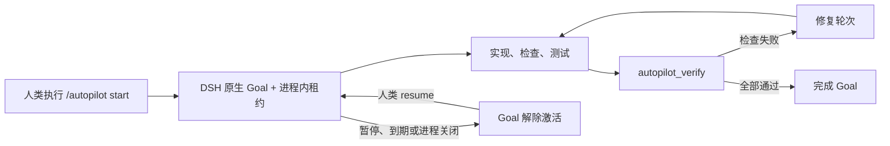

# DSH Autopilot

[English](README.md)

面向 [DeepSeek Harness](https://github.com/deepseek-ai/deepseek-harness) 的长时、受验证器约束的自主开发插件。

**给 DSH 一个目标、一份预算和一条明确的完成线。** 只需启动一次 Autopilot，模型就能在有边界的多个 Goal 轮次中持续实现、检查、测试、修复并验证结果。

- **运行数天，而不是数小时。** 活跃时间租约默认 7 天，部署上限可配置到 30 天。
- **用证据完成任务。** Autopilot 活跃时，模型不能自行宣告完成；只有部署方固定的命令能够通过验收。
- **失败后继续修复。** 验证失败会把具体结果交给下一轮 Goal，而不是让长任务停在半途。
- **按需创建运行时工具。** 可选的 Host-only Cordis 扩展允许模型在当前租约内定义临时能力。
- **保持 DSH 原生。** 不 fork、不修改 `agent-loop`、不建立隐藏 Goal 数据库，也不静默提升权限。

本项目的灵感来自 [oh-my-codex](https://github.com/Yeachan-Heo/oh-my-codex) 与 [oh-my-openagent](https://github.com/code-yeongyu/oh-my-openagent)（原名 `oh-my-opencode`），并围绕 DSH 原生 Goal、Cordis、工具策略和 session 能力重新实现长时 Agent 体验。

> [!IMPORTANT]
> DSH Autopilot 是独立的第三方项目，不属于 DeepSeek，不是 DSH 的 fork，也不能绕过 DSH 权限。它的所有能力都通过增量式 Cordis 插件行安装，并且可以完整卸载。

## 从一条命令到经过验证的完成

DSH 已经提供了关键原语：可持久化的 Goal、自动 Goal 轮次、workflow 与 subagent、工具 guard、Shell 执行、session 日志以及运行时 Cordis Package。但是，这些能力尚未被组合成一套由人类授权、能够长时间运行并由固定检查决定完成的产品入口。

DSH Autopilot 增加了这一层控制：

1. 人类授权明确的目标、轮次上限和活跃时间预算；
2. DSH 通过原生 Goal 持续推进多个模型回合；
3. 模型实现、检查、测试并修复工作区；
4. 只有部署配置中的验证命令可以完成 Goal；
5. 可选的动态 Cordis 扩展仍受当前 DSH preset 和权限策略限制；
6. 暂停、到期、关闭和重启都会以关闭自治权限的方式安全失败。

默认租约面向以天计的任务，而不是几小时：256 个 Goal 轮次和 7 天活跃时间。部署默认上限为 1,024 个轮次和 30 天活跃时间，暂停期间不计时。

## 扩展了哪些能力

| 能力 | 对 DSH 的增量扩展 |
|---|---|
| 人类授权 | 为顶层 Agent 提供 `/autopilot start`、`status`、`pause`、`resume` 和 `stop`。模型不能自行授予或延长租约。 |
| 长时 Goal 控制 | 在 DSH 原生持久 Goal 和 Goal Round Driver 外增加有预算的进程内自治租约。 |
| 验证器所有的完成权 | `autopilot_verify` 执行部署方固定的命令。租约活跃时，模型不能直接宣告 Goal 完成。 |
| 自动修复轮次 | 验证失败后重新激活同一个 Goal，并把可检查的结果交给下一轮修复。 |
| 独立资源预算 | 分别限制活跃时长、Goal 轮次、验证次数和成功定义的动态 Package 数量。 |
| 动态 Cordis 策略 | 用 `off`、`host-only` 和 `client-approved` 三种模式约束 DSH 已有的 `cordis_define` 与 `cordis_run`。 |
| 模型状态上下文 | `get_autopilot` 和 system-prompt 策略段向模型提供 Goal、租约阶段和剩余预算。 |
| 内置工作流 Skill | `autonomous-development` Skill 指导兼容的 DSH preset 正确执行循环并把完成权交给验证器。 |
| 安装诊断 | `dsh-autopilot doctor` 检查 Node 兼容性，并确认每个 bundle 插件行恰好出现一次。 |

安装包向目标 DSH profile 增量加入四个 Cordis 行：

| 行 ID | 职责 |
|---|---|
| `dsh-autopilot-service` | 校验部署上限并持有进程内自治租约。 |
| `dsh-autopilot-commands` | 注册人类使用的 `/autopilot` 命令。 |
| `dsh-autopilot-tools` | 注册模型工具、策略上下文、完成 guard、验证器执行和动态 Package 计量。 |
| `dsh-autopilot-skills` | 通过 DSH 公共 Skill 服务注册随包发布的工作流 Skill。 |

项目不会修改或替换任何 DSH 源文件。

## 运行流程



原生 Goal 会随 session 持久化。授权租约、到期计时器、验证计数和动态 Package receipt 则刻意只存在于当前进程。DSH 重启后，Goal 会保持未激活状态，直到人类明确执行 `/autopilot resume`。

## 状态与兼容性

本项目仍处于预发布阶段。当前 alpha 版本针对以下环境开发和测试：

- DSH `0.1.0-rc.5`；
- `@deepseek-ai/cordis` `4.0.1`；
- Node.js `^22.19.0` 或 `>=24.0.0`。

DSH 仍处于 RC 开发阶段，因此本项目使用较窄的 peer 版本，并在升级时进行明确的兼容性验证。

## 安装

alpha 版本通过 npm 的 `next` 标签发布，规范包名为 `dsh-autopilot`。把当前 alpha 安装到 DSH profile，并检查最终 bundle：

```sh
dsh plugin --profile web add dsh-autopilot@next
dsh --profile web --dump-config
dsh plugin --profile web exec dsh-autopilot doctor --profile web
```

如需精确锁定当前版本：

```sh
dsh plugin --profile web add dsh-autopilot@0.1.0-alpha.1
```

### 安装 GitHub Release 产物

下载 Release 附带的 `.tgz`，再把这个确定的产物安装到 DSH profile：

```sh
mkdir -p .artifacts
gh release download v0.1.0-alpha.1 \
  --repo LiuMengxuan04/dsh-autopilot \
  --pattern 'dsh-autopilot-*.tgz' \
  --dir .artifacts

dsh plugin --profile web add \
  ./.artifacts/dsh-autopilot-0.1.0-alpha.1.tgz
dsh --profile web --dump-config
dsh plugin --profile web exec dsh-autopilot doctor --profile web
```

### 构建本地 tarball

当前开发环境要求精确的 DSH checkout 位于相邻的 `../harness`：

```sh
pnpm install --frozen-lockfile
pnpm pack --pack-destination .artifacts

dsh plugin --profile web add \
  ./.artifacts/dsh-autopilot-0.1.0-alpha.1.tgz
dsh plugin --profile web exec dsh-autopilot doctor --profile web
```

目前不支持通过 `github:` 或 `git+https:` 直接安装源码仓库。这个 TypeScript 包没有用于 git 安装的 `prepare` 路径；请使用 npm 或预构建 tarball，确保实际安装的 JavaScript 对应经过审阅的发布产物。

## 快速开始

### 1. 配置有意义的验证命令

随包默认配置只运行 `git diff --check`。它适合作为打包安全的冒烟检查，但不足以证明绝大多数项目已经完成。在授权重要任务前，应配置真正覆盖仓库验收条件的命令。

后加载的 DSH patch 可以替换 bundle 配置。Cordis patch 会替换某一行的完整 `config`，因此覆盖时必须重新写出所有字段。例如，把下面内容加入 `$DSH_HOME/profiles/web/cordis.patch.yml`：

```yaml
- id: dsh-autopilot-service
  config:
    defaultMaxGoalRounds: 512
    maxGoalRounds: 1024
    defaultMaxActiveMs: 1209600000 # 14 天
    maxActiveMs: 2592000000       # 30 天
    maxVerificationAttempts: 3
    maxDynamicPackages: 8
    selfModification: host-only

- id: dsh-autopilot-tools
  config:
    minimumEvidenceItems: 2
    maxOutputChars: 8000
    checks:
      - name: types
        command: pnpm run typecheck
        timeoutMs: 300000
      - name: tests
        command: pnpm run test
        timeoutMs: 600000
```

修改 patch 后需要重启对应的 DSH profile。

### 2. 选择 DSH Agent preset

Autopilot 本身可以在支持 command 的 DSH 组合中工作。如果需要模型创建临时 Cordis 能力，请在启动任务前选择 DSH 自带的 `cordis` preset。该 preset 提供 `cordis_define` 和 `cordis_run`。

DSH Autopilot 不会把这些工具注入 `standard`、`code` 或其他 preset。当前 Agent 组合中不存在的工具仍然不可用。

### 3. 启动有边界的自治任务

启动 DSH Web，在顶层 session 中输入：

```text
/autopilot start 实现所需功能，并验证每一项验收条件。
```

任务需要不同预算时，可以覆盖默认租约：

```text
/autopilot start --rounds 512 --duration 14d 完成迁移并证明其安全性。
```

时间单位支持 `ms`、`s`、`m`、`h`、`d` 和 `w`。请求可以调整默认值，但不能超过部署上限。

### 4. 查看和控制任务

```text
/autopilot status
/autopilot pause
/autopilot resume
/autopilot resume --duration 7d
/autopilot stop
```

- `status` 显示 Goal 阶段、激活状态、轮次、剩余活跃时间、验证次数、Package 数和自修改模式。
- `pause` 解除 Goal 激活，并冻结同一进程中的剩余活跃时间。
- `resume` 重新激活 Goal。进程重启后，它会建立一份新的人类授权租约。
- `stop` 撤销租约并暂停原生 Goal，但不会删除 DSH session 历史。

模型使用 `get_autopilot` 查看同样的预算。它认为目标已准备完成时，会调用 `autopilot_verify` 并提交摘要与证据列表。模型不能选择验证命令。检查失败会进入修复轮次；只有全部配置检查通过后，插件才会完成原生 Goal。

## 动态 Cordis 自扩展

Autopilot 可以在活跃租约期间约束 DSH 已有的运行时 Cordis 工具：

- `off`：拒绝自治调用 `cordis_define` 和 `cordis_run`；
- `host-only`：接受不包含 Client 代码的定义，并且只允许运行同一 Agent、同一租约成功创建的精确 `(pluginId, packageId)` receipt；
- `client-approved`：把包含 Client 的执行交给 DSH 原生审批流程。

默认模式是 `host-only`。成功定义会消耗 Package 预算；失败定义、其他 Agent 的定义、旧租约和先前进程中的定义都不能授权运行。

此功能**不会**安装 npm 包、持久化生成的插件、扩大 sandbox、暴露凭据或绕过审批。Cordis VM 是一种执行机制，不是安全边界。在敏感工作区启用自扩展前，请阅读[自治与安全](docs/autonomy-and-security.md)。

## 安全模型与当前限制

DSH Autopilot 只能进一步收紧活跃模型的行为，不能授予当前 DSH profile 原本没有的权限。文件系统、Shell、子进程、网络、凭据、sandbox 和审批策略仍由 DSH 与宿主操作系统决定。

首个 alpha 明确不承诺：

- 进程或机器重启后无人值守自动恢复；
- 持久化自治租约或动态 Cordis Package；
- 无需审批执行 Client 代码；
- 为动态 Host JavaScript 提供安全沙箱；
- 超出配置验证命令覆盖范围的语义完成证明；
- UI 面板、远程调度器或后台 daemon。

对于长时任务，请先保存重要工作区状态，使用受约束的 DSH 权限 profile，避免提供生产凭据，配置有意义的验证检查，并选择满足任务所需的最小租约。

## 架构

npm manifest 将 `cordis.patch.yml` 暴露为普通 DSH bundle layer。它插入四个带命名空间的行，并且只导入公开的 DSH Service Definition。所有注册都使用 Cordis 生命周期 effect，因此卸载 bundle 会一并清理命令、工具、上下文、计时器和 Skill。

DSH 始终是 Goal 与 transcript 的事实来源。Autopilot 不修改 `agent-loop`，不把隐藏状态写进 DSH 仓库，也不维护另一套与 DSH 竞争的 Goal ledger。

详细文档：

- [架构](docs/architecture.md)
- [自治与安全](docs/autonomy-and-security.md)
- [测试](docs/testing.md)

## 设计参考与来源

DSH Autopilot 是独立实现，不是下列项目的 fork，也不表示存在兼容关系或隶属关系。

- [DeepSeek Harness](https://github.com/deepseek-ai/deepseek-harness) 提供了本项目所组合的插件架构、原生 Goal 与 Goal Round Driver、session 历史、工具 guard、Shell 能力、Skill 服务和动态 Cordis 执行能力。
- [oh-my-codex](https://github.com/Yeachan-Heo/oh-my-codex) 启发了持久化长任务工作流、明确的完成证据、失败修复循环以及可观察进度等设计重点。
- [oh-my-openagent](https://github.com/code-yeongyu/oh-my-openagent)（原名 `oh-my-opencode`）启发了 Goal 持续推进的使用体验，以及通过简洁入口组合已有 Agent 能力的思路。

本项目刻意采用了 DSH 风格的差异化设计：授权是明确的人类租约；验证命令属于部署配置；运行时扩展复用原生 Cordis 工具；重启始终解除激活；bundle 永远不修改 DSH。

## 卸载

先暂停或停止活跃任务，再停止对应 DSH 进程并移除 bundle：

```sh
dsh plugin --profile web remove dsh-autopilot
dsh --profile web --dump-config
```

卸载会移除 profile 依赖和 bundle 插件行，但不会删除 DSH 原生 session 日志或 Goal。

## 开发与验证

将本仓库放在锁定版本的 DSH checkout 旁边：

```text
code/
├── harness/
└── dsh-autopilot/
```

然后运行：

```sh
pnpm install --frozen-lockfile
pnpm run typecheck
pnpm run lint
pnpm run test:coverage
pnpm run build
pnpm exec publint
DSH_AUTOPILOT_E2E_BROWSER_CHANNEL=msedge pnpm run test:e2e
```

无密钥的 packed E2E 会把 tarball 安装到隔离的真实 DSH Web profile，选择 `cordis` preset，通过 command UI 启动 Autopilot，定义并运行 Host-only 动态工具，回放两个 Goal 轮次，执行固定验证器并检查持久化完成结果。测试不会修改相邻的 DSH checkout。

## 许可证

[MIT](LICENSE)
