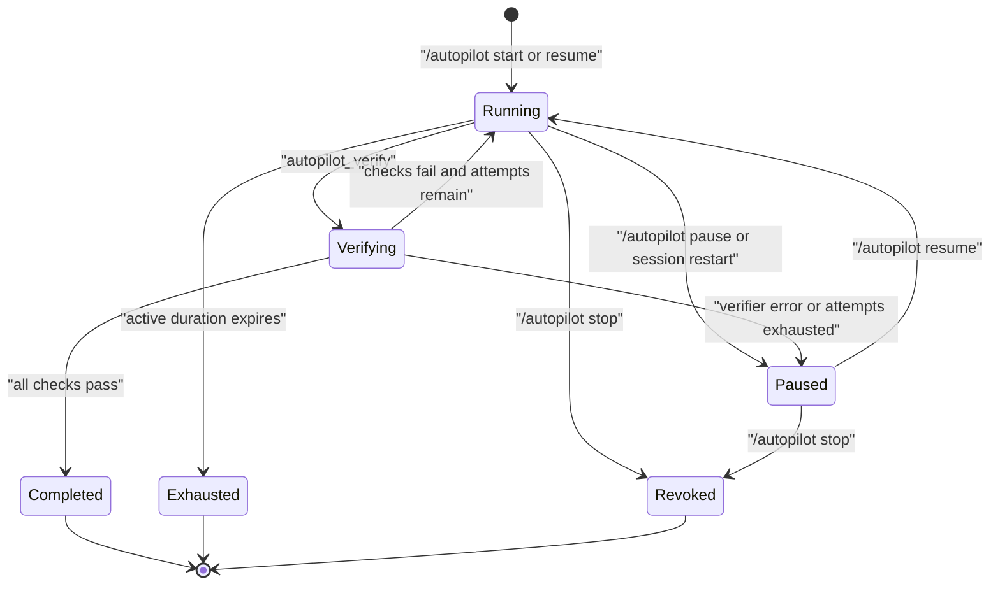

# Architecture

## Product boundary

DSH Autopilot is an out-of-tree DSH bundle. Its npm manifest points DSH at `cordis.patch.yml`; the patch inserts four additive rows with stable IDs. It does not override a DSH row, import private DSH source paths, or require a change in the DSH repository.

DSH applies bundle patches before profile, home, and command-line overlays. Operators can therefore override or disable DSH Autopilot through normal Cordis patch composition. Removing the dependency removes the complete runtime contribution.

## Runtime components

| Row | Module | Responsibility |
|---|---|---|
| `dsh-autopilot-service` | `dsh-autopilot/service` | Validate deployment limits and own process-local autonomy leases. |
| `dsh-autopilot-commands` | `dsh-autopilot/commands` | Register the human `/autopilot` command and translate it into native Goal and lease operations. |
| `dsh-autopilot-tools` | `dsh-autopilot/tools` | Add model context, status and verifier tools, completion guards, fixed checks, and dynamic-Package accounting. |
| `dsh-autopilot-skills` | `dsh-autopilot/skills` | Read, validate, and register the packaged skill through DSH's public Skill Service. |

The service depends on DSH's Goal capability. The command plugin also depends on the top-level Agent registry and command registry. The tool plugin uses DSH's tools, system prompt, shell, and Goal capabilities. All registrations follow Cordis lifecycle disposal.

## State ownership

The design deliberately splits durable intent from ephemeral authorization:

| State | Owner | Lifetime | Examples |
|---|---|---|---|
| Goal | DSH Goal service | Session-durable | objective, phase, activation, rounds started, round limit |
| Lease | `AutonomyService` | Current DSH process | active-time budget, expiry timer, verifier attempts, self-modification mode |
| Dynamic Package receipt | Tool plugin | Current agent and process | Host-only definitions permitted for later `cordis_run` |
| Transcript | DSH Session | Session-durable | human command input, Goal changes, tool calls and results, verifier evidence |

No custom required Session event is introduced. Model-visible Autopilot context is regenerated from the native Goal and current lease on each request. This keeps the bundle compatible with DSH's known-event validation without changing DSH's generated event registry.

After shutdown, the Goal remains durable but disarmed. The lease and dynamic-Package receipts do not return. `/autopilot resume` is the explicit human authorization that creates a new lease and arms the Goal again.

## Authorization lifecycle

`start` validates the requested round and duration budgets before creating a Goal. The default is 256 rounds and seven active days. The default deployment ceilings are 1024 rounds and 30 active days. Pausing records remaining active time. A same-process resume continues that interval; a fresh-process resume validates and grants the requested duration, or the deployment default when omitted.

The lease timer is segmented because Node timers cannot represent the full 30-day default ceiling in one delay. Each segment rechecks the remaining budget before scheduling the next segment. Expiry disarms the Goal, marks the lease exhausted, aborts lease-scoped activity, and asks the Agent loop to stop keeping the inbox active.

## Iteration and completion

An armed native Goal already gives DSH a durable multi-round loop. DSH Autopilot hides `create_goal` from that Agent while its current Goal is non-terminal and adds a policy section instructing the model to keep working and to use `autopilot_verify` instead of completing the Goal directly.

The tool guard rejects `update_goal` completion while a lease is active. `autopilot_verify` then:

1. validates the model's non-empty summary and evidence count;
2. moves the lease to `verifying` and disarms the Goal;
3. runs every deployment-fixed shell check in the Agent workspace with the tool and lease cancellation signals;
4. bounds retained stdout and stderr for each result;
5. rearms the same Goal and ends the turn after a failed check, or atomically completes the Goal and lease after all checks pass and defers a final user-facing handoff instruction;
6. blocks the Goal and pauses the lease when verifier infrastructure fails or the attempt budget is exhausted.

The model chooses neither command strings nor completion semantics. Verification commands come from the resolved Cordis configuration.

## Dynamic Cordis extension

Dynamic Cordis is conditional on Agent composition. The session's DSH Agent preset must contribute `cordis_define` and `cordis_run`; DSH's shipped `cordis` preset is the recommended composition. DSH Autopilot neither injects those tools into other presets nor makes an unavailable operation available.

When those tools exist, DSH Autopilot does not replace them. It installs a monotonic guard around their use during an active lease:

- `off` denies define and run operations;
- `host-only` rejects a definition containing Client code, counts successful definitions, and records the exact `(pluginId, packageId)` pair in process memory; a later run is allowed only for a receipt from the same Agent and lease;
- `client-approved` delegates Client-bearing execution to DSH's native approval path.

Receipts are recorded from successful `tools/result` events, not from proposed arguments. An around-dispatch reservation prevents concurrent definitions from oversubscribing the remaining budget before their results settle. A process restart or Agent disposal clears receipts and reservations. The dynamic-Package budget defaults to eight successful definitions per lease.

Host-only adds no separate approval prompt for an eligible Host-only definition, but it does not expand the Agent's authority. Tool availability and DSH filesystem, shell, sandbox, credential, permission, and deployment policies remain authoritative. Client-half code still uses DSH's native approval path.

This is a cooperative product policy, not isolation. The Cordis VM is an execution mechanism and is not treated as a security boundary.

## Distribution

The published artifact contains built ESM entry points, declarations, `cordis.patch.yml`, README, design and security documents, license, and the bundled autonomous-development skill. DSH installs the package into one profile and appends its bundle name to that profile's ordered bundle list. No install script edits DSH or the user's workspace.

The `dsh-autopilot doctor` executable resolves the selected profile with `dsh --dump-config` and checks that all four rows occur once. It is intentionally diagnostic only.

## Deferred capabilities

The first alpha does not provide cross-process unattended resume, durable dynamic Packages, a remote scheduler, a Client UI, a fresh-model completion judge, or a security sandbox. These require explicit DSH extension points or separate trusted services and must not be simulated through hidden state or DSH source patches.
